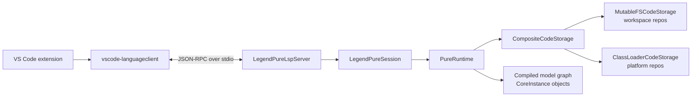
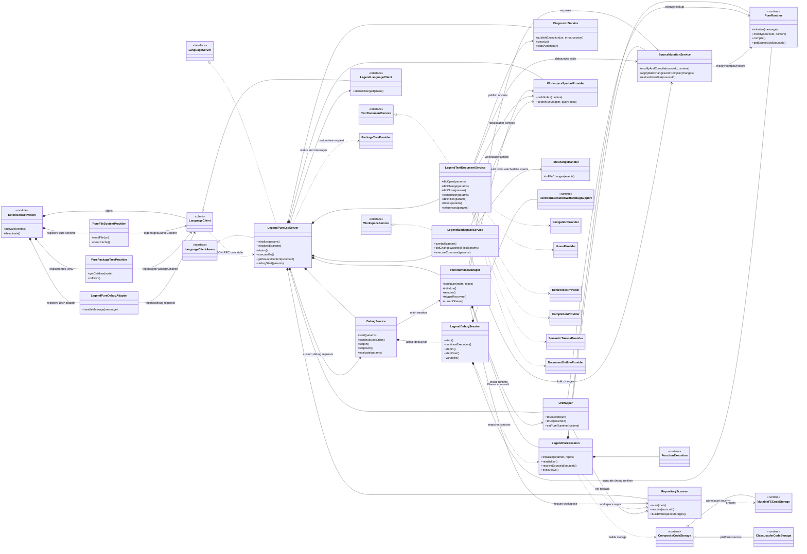
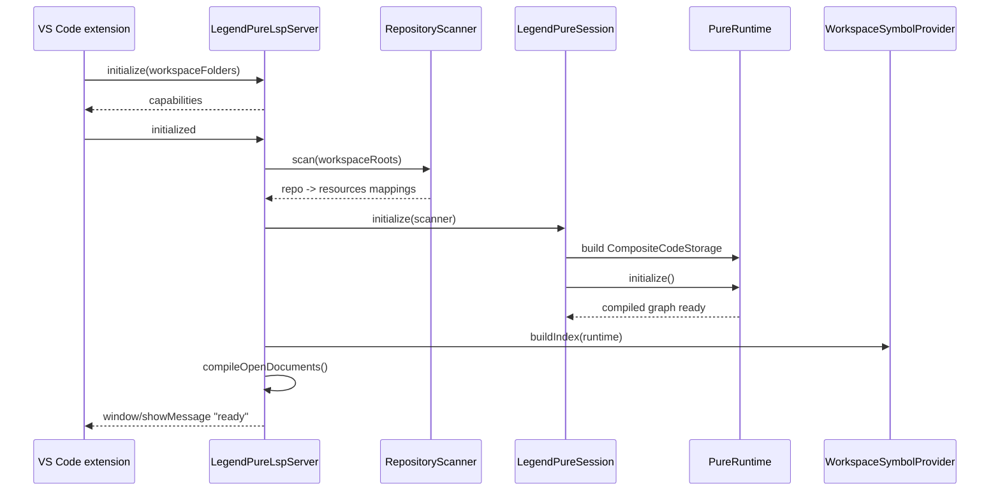

# Legend Pure LSP: how it works

This document explains the LSP implementation in this worktree:
`feature/lsp-legend-remote-sync`.

The short version is:

1. The VS Code extension starts a Java LSP server process with `java -jar`.
2. The Java server builds a `PureRuntime`.
3. Workspace `.pure` files are loaded from disk through `MutableFSCodeStorage`.
4. Platform Pure sources are loaded from the server JAR through `ClassLoaderCodeStorage`.
5. Editor changes are pushed into `PureRuntime`, compiled, and exposed through normal LSP features. For workspace storage-backed sources, that currently writes through to disk.
6. Navigation results are mapped back to either real `file://` URIs or read-only `pure://` virtual files.

## Presentation guide

Use this document in two layers:

1. Presentation layer: explain the architecture, lifecycle, and tradeoffs using the diagrams and talking points in the next few sections.
2. Reference layer: use the detailed sections later in the document when someone asks exactly where a mechanism lives in code.

### Main thesis

The Legend Pure LSP is not a standalone parser. It is a VS Code front end over a live `PureRuntime`.

That design gives the LSP high-quality semantic features because it uses the same compiled graph as the Pure runtime. The cost is that source synchronization, runtime mutation, and repository mapping must be handled carefully.

### Three ideas to get across

| Idea | Why it matters |
| --- | --- |
| `PureRuntime` is the semantic engine | Hover, definition, references, outline, symbols, and execution all come from the compiled graph, not regex parsing. |
| Source IDs are the central contract | VS Code speaks URIs; PureRuntime speaks source IDs. Most correctness issues are mapping issues. |
| Storage choice defines synchronization behavior | Workspace files are mutable filesystem storage; platform files are read-only classpath storage; scratch files are in-memory. |

### Suggested presentation structure

For a 15-20 minute technical presentation:

| Time | Topic | Message |
| --- | --- | --- |
| 2 min | Problem and goal | Provide real Pure language intelligence inside VS Code. |
| 3 min | Architecture | VS Code client starts Java server; server owns `PureRuntime`; runtime owns compiled graph. |
| 4 min | Repository and storage model | Workspace repos from `*.definition.json`; platform repos from JAR; source IDs connect everything. |
| 4 min | Change lifecycle | Editor changes, external file changes, reindex, and recovery are separate paths. |
| 4 min | Feature implementation | LSP features query the compiled graph through provider classes. |
| 2 min | Tradeoffs and risks | Write-through storage, synchronization timing, runtime locking, stale repo discovery. |

For a shorter 5 minute version:

1. The extension launches a Java server.
2. The Java server builds a `PureRuntime` over workspace plus platform repositories.
3. Every LSP feature asks the compiled Pure graph questions.
4. URI/source-ID mapping is the glue.
5. Change reflection happens only after runtime mutation plus compile.

## Architecture at a glance



The ownership boundary is important:

| Layer | Owns | Does not own |
| --- | --- | --- |
| VS Code extension | UI, commands, tree view, virtual filesystem, language model tools | Pure parsing or compilation |
| LSP server | Protocol handlers, synchronization, diagnostics, provider orchestration | VS Code editor state |
| `LegendPureSession` | The active runtime and serialized mutation methods | LSP protocol details |
| `PureRuntime` | Source registry, compiler, graph, execution | Workspace discovery |
| Storage implementations | Reading/writing source content | LSP features |

## Class architecture

Use this diagram when someone asks "which class owns what?" The important shape is:

1. `LegendPureLspServer` is the composition root and LSP entry point.
2. `PureRuntimeManager` owns lifecycle state: initialize, reindex, recovery, status.
3. `LegendPureSession` is the synchronized boundary around the mutable `PureRuntime`.
4. `SourceMutationService` is the only normal path for mutating sources and compiling.
5. Provider classes read the compiled graph and translate results back to LSP types.



### How to explain the diagram

| Area | What to say |
| --- | --- |
| VS Code side | `extension.ts` starts `LanguageClient`, registers commands, registers the read-only `pure://` filesystem, registers the package tree, and wires the debug adapter. It does not parse or compile Pure. |
| Server shell | `LegendPureLspServer` implements LSP4J `LanguageServer`, reports capabilities, owns services, and exposes custom `legend/*` requests. |
| Runtime lifecycle | `PureRuntimeManager` is the state machine for startup, reindex, recovery, and status notifications. |
| Runtime core | `LegendPureSession` owns `PureRuntime` and `FunctionExecution`; callers synchronize on the session before reading or mutating the graph. |
| Source changes | `SourceMutationService` wraps `PureRuntime.modify`, `createInMemorySource`, `delete`, and `compile`, including rollback for failed compile paths. |
| URI/source mapping | `UriMapper` bridges VS Code URIs, Pure source IDs, and `pure://`; `RepositoryScanner` discovers workspace repositories and creates filesystem storage. |
| Feature providers | Navigation, hover, references, completion, semantic tokens, outline, package tree, and workspace symbols are graph readers over compiled `CoreInstance` data. |
| Debugging | `DebugService` creates a separate instrumented debug runtime through `LegendDebugSession`, so normal editing runtime state is not reused as the debug execution engine. |

The shortest meeting version: the VS Code extension is thin, the server is the orchestrator, and the real language intelligence comes from `PureRuntime`. Most bugs are either synchronization bugs around the mutable runtime or mapping bugs between URI and source ID.

## Key runtime lifecycle



The runtime is not ready immediately after `initialize`. The LSP capability response is fast, then the expensive runtime initialization happens asynchronously after `initialized`.

## PureRuntime primer

If you are not already familiar with PureRuntime, think of it as a live compiler plus semantic database for Pure code.

It has three jobs:

1. Load Pure source text from one or more repositories.
2. Compile that text into a graph of model objects.
3. Answer semantic questions against that graph.

In LSP terms:

| LSP question | PureRuntime data used to answer it |
| --- | --- |
| "What is under my cursor?" | `Source.navigate(line, column, processorSupport)` |
| "Where is it defined?" | The target element's `SourceInformation` |
| "What references this class/function/property?" | `referenceUsages` and function `applications` on compiled graph objects |
| "What symbols exist?" | The package tree rooted at `::` |
| "What should hover show?" | Classifier, package path, properties, generic types, enum values |
| "Can this file compile?" | `PureRuntime.modify(...)` plus `PureRuntime.compile()` |
| "Can I run this function?" | `FunctionExecutionInterpreted` over a compiled function |

### PureRuntime in one slide

```text
Repository storage
  gives PureRuntime source IDs and source text

SourceRegistry
  remembers loaded Source objects by source ID

Parser and incremental compiler
  turn changed Source objects into CoreInstance graph objects

ModelRepository and ProcessorSupport
  hold and query the compiled graph

LSP providers
  ask the graph semantic questions and convert answers to LSP types
```

### The core concepts

| Concept | Plain-language meaning | Example |
| --- | --- | --- |
| Repository | A logical Pure codebase with a name and pattern. | `core`, `platform`, `core_relational` |
| Code storage | How PureRuntime reads files from that repository. | Filesystem, classpath/JAR, composite |
| Source ID | PureRuntime's stable file identifier. | `/core/pure/lang.pure` |
| Source | Loaded source text plus compile state. | One `.pure` file or scratch source |
| CoreInstance | A compiled model object. | A Class, Enumeration, Function, Property, Package |
| SourceInformation | Where a compiled object came from in source text. | source ID, start line/column, end line/column |
| ProcessorSupport | Runtime helper for resolving paths and graph relationships. | Find `meta::pure::metamodel::type::Class` |
| ImportStub | A placeholder reference that must be resolved to the real target. | Imported `String` resolving to platform `String` |
| SourceMutation | The compiler's description of what changed after compile. | Modified source IDs |

### What a Pure compile creates

Take this simplified Pure source:

```text
Class demo::Person
{
  name: String[1];
}
```

After compilation, the runtime has graph objects roughly like this:

```text
Package demo
  child -> Class Person

Class Person
  classifier -> Class
  properties -> Property name
  sourceInformation -> /some_repo/demo/Person.pure line/column range

Property name
  genericType -> String
  multiplicity -> [1]
  sourceInformation -> exact location of the property
```

The LSP does not need to parse the text to understand this class. It asks the compiled graph:

1. For document outline: "What top-level instances came from this source?"
2. For hover: "What element is under this source position, and what are its properties?"
3. For definition: "What real target does this reference resolve to, and where is its source information?"
4. For references: "What graph objects recorded usages of this element?"

### How PureRuntime loads sources

PureRuntime does not start with a directory path. It starts with `RepositoryCodeStorage`.

In this LSP, `LegendPureSession` builds this:

```text
CompositeCodeStorage
  - MutableFSCodeStorage(repo = workspace repo A, root = .../src/main/resources/repoA)
  - MutableFSCodeStorage(repo = workspace repo B, root = .../src/main/resources/repoB)
  - ClassLoaderCodeStorage(platform repos from server JAR)
```

When PureRuntime initializes, it asks the storage layer for user files:

```text
codeStorage.getUserFiles()
```

Each returned path is a Pure source ID, not an OS path:

```text
/repoA/path/File.pure
/platform/pure/essential/lang.pure
```

Then the runtime loads each source ID into the `SourceRegistry` as a `Source`.

For filesystem storage, content comes from disk. For classpath storage, content comes from JAR resources. For in-memory scratch sources, content comes from the LSP request itself.

### What "compiled" means

Each `Source` has a `compiled` flag.

When the source content changes:

```text
Source.updateContent(newText)
-> event handler tells IncrementalCompiler the source changed
-> source.compiled = false
```

When the runtime compiles:

```text
PureRuntime.compile()
-> collect all uncompiled sources
-> parse and compile them
-> update graph objects
-> mark sources compiled
-> return SourceMutation
```

This is incremental in the sense that the runtime does not intentionally recompile every source on every edit. It compiles the sources that have been marked uncompiled and applies the resulting graph mutation. Dependencies can still cause broader graph updates, which is why the LSP uses the returned `modifiedFiles` to clear related diagnostics.

### Why the LSP synchronizes access

PureRuntime is mutable:

```text
modify source
-> invalidate source graph pieces
-> compile
-> update graph
```

At the same time, hover, definition, references, semantic tokens, and outline all read the same graph. Reading during mutation can see inconsistent state.

That is why the LSP has a simple rule:

```text
All runtime writes go through synchronized LegendPureSession methods.
Runtime graph reads synchronize on the same session object.
```

This is conservative, but it keeps the first version understandable and safe.

## Change reflection summary

This is the table to show when someone asks, "When does the LSP see my change?"

| Change source | Discovery mechanism | Runtime update | Compile timing | Notes |
| --- | --- | --- | --- | --- |
| User typing in an open `.pure` file | LSP `didChange` full text sync | `modifyAndCompile(sourceId, editorText)` | 300ms debounce | For storage-backed workspace sources, current implementation writes through to disk. |
| User opens a file before runtime is ready | `didOpen` stores text in `openDocuments` | Replayed by `compileOpenDocuments()` | After runtime initialization | Prevents lost edits during startup. |
| User closes an open file | LSP `didClose` | `restoreFromDisk(sourceId)` | Immediately | Restores from current storage content, not from a separate pre-edit snapshot. |
| External edit, git checkout, remote sync | VS Code `didChangeWatchedFiles` | `applyBulkChangesAndCompile(changes)` | One compile after all changes | Only for `.pure` files under already discovered repository layout. |
| New repository/module | Manual command or recovery | Rescan repositories and rebuild runtime | Full runtime reinitialize | File watcher alone does not discover new `*.definition.json` repositories. |
| Platform/JAR source | Classpath storage | No mutation | Rebuild server JAR if source changed upstream | Opened through `pure://` as read-only. |
| Scratch file outside repo | URI fallback to filename | In-memory source | On edit compile | Does not write to workspace repository storage. |

## Critical design tradeoffs

| Decision | Benefit | Cost or risk |
| --- | --- | --- |
| Use real `PureRuntime` | Accurate semantic behavior and execution support. | Runtime is mutable and must be synchronized. |
| Use `MutableFSCodeStorage` for workspace repos | Runtime reads real checked-out source; no stale JAR copy for workspace code. | `PureRuntime.modify` writes through to disk for storage-backed sources. |
| Use `ClassLoaderCodeStorage` only for platform repos | Stable built-in Pure sources without local checkout. | Non-platform repos not checked out are skipped, so missing source means missing symbols. |
| Rebuild symbol index after successful compile | Workspace symbol search stays current. | Compile success can trigger index rebuild cost. |
| Use `pure://` for JAR-only sources | Navigation can open platform definitions. | Source is read-only and served through a custom VS Code filesystem provider. |
| Serialize runtime access through session locking | Avoid graph reads during mutation. | Long compiles can block semantic requests. |

## Main modules

The implementation is split into two sibling modules:

| Module | Purpose |
| --- | --- |
| `legend-engine-xt-lsp-server` | Java LSP server. Owns `PureRuntime`, compilation, indexing, diagnostics, and feature providers. |
| `legend-engine-xt-lsp-vscode` | VS Code extension. Starts the server, wires VS Code commands/views/tools, and exposes `pure://` files. |

The server entry point is:

```text
legend-engine-xts-lsp/legend-engine-xt-lsp-server/src/main/java/org/finos/legend/engine/lsp/LegendPureLspServer.java
```

The VS Code extension entry point is:

```text
legend-engine-xts-lsp/legend-engine-xt-lsp-vscode/src/extension.ts
```

## Mental model

There are three names for the same Pure file, depending on which layer you are in.

| Layer | Example | Meaning |
| --- | --- | --- |
| VS Code URI | `file:///home/me/legend-engine/.../src/main/resources/core/test/model.pure` | The file opened in the editor. |
| Pure source ID | `/core/test/model.pure` | The ID used inside `PureRuntime`. |
| Virtual URI | `pure:///platform/pure/essential/lang.pure` | A read-only source served out of the runtime when there is no workspace file. |

`UriMapper` is the bridge between these forms.

For normal workspace files, the source ID is the path after `src/main/resources/`.

```text
file:///repo/module/src/main/resources/core_relational/tests/model.pure
-> /core_relational/tests/model.pure
```

For classpath-only sources, the source ID gets a `pure://` URI.

```text
/platform/pure/essential/lang.pure
-> pure:///platform/pure/essential/lang.pure
```

For scratch files outside a Pure repository, the fallback source ID is just the filename, for example `scratch.pure`.

## Startup flow

Startup begins in the VS Code extension.

1. VS Code activates the extension for `.pure` files.
2. `extension.ts` resolves the server JAR.
3. The extension starts the server with `java -jar <server-jar>`.
4. `vscode-languageclient` connects over standard input and standard output.
5. The server advertises capabilities during LSP `initialize`.
6. After LSP `initialized`, the server initializes `PureRuntime` asynchronously.

The server JAR lookup order is:

1. `legendPure.server.jarPath` from VS Code settings.
2. A sibling Maven server module relative to the extension.
3. `legend-engine-xts-lsp/legend-engine-xt-lsp-server/target` under each workspace folder.

The server main method does one important transport detail: it redirects normal `System.out` logging to stderr and keeps the original stdout only for JSON-RPC. LSP over stdio breaks if logs are written to stdout.

## Server capabilities

`LegendPureLspServer.initialize` advertises these capabilities:

| Capability | Handler |
| --- | --- |
| Full text sync | `LegendTextDocumentService.didOpen`, `didChange`, `didClose` |
| Completion | `CompletionProvider` |
| Go to definition | `NavigationProvider` |
| Find references | `ReferencesProvider` |
| Hover | `HoverProvider` |
| Document symbols | `DocumentOutlineProvider` |
| Workspace symbols | `WorkspaceSymbolProvider` |
| Semantic tokens | `SemanticTokensProvider` |
| Execute command | `legend.reindexWorkspace` |

The source currently implements completion, document symbols, and semantic tokens. If an older README says they are not implemented, the README is stale for this worktree.

## Repository scanning

The server needs to know which Pure repositories are checked out in the local workspace. That is handled by `RepositoryScanner`.

The list of workspace roots comes from the LSP `InitializeParams`:

1. Prefer `workspaceFolders`.
2. If none are provided, fall back to `rootUri`.
3. Convert each URI to a local `Path`.

After that, `RepositoryScanner.scan(workspaceRoots)` walks each root and looks for files named:

```text
*.definition.json
```

It skips directories that are not source inputs:

```text
hidden directories
target
node_modules
```

Only definition files under `src/main/resources` are considered repository definitions. The scanner reads the `"name"` field and stores:

```text
repo name -> resources root
repo name -> definition file
```

Example:

```text
core_relational.definition.json
at /repo/legend-engine-xts-relationalStore/.../src/main/resources/core_relational.definition.json

maps:
core_relational -> /repo/legend-engine-xts-relationalStore/.../src/main/resources
```

That mapping is used in both directions:

| Direction | Example |
| --- | --- |
| Source ID to file path | `/core_relational/a/b.pure` -> `<resourcesRoot>/core_relational/a/b.pure` |
| File path to source ID | `<resourcesRoot>/core_relational/a/b.pure` -> `/core_relational/a/b.pure` |

When it creates `MutableFSCodeStorage`, the scanner uses this root:

```text
<resourcesRoot>/<repoName>
```

That matters because `MutableFSCodeStorage` already prepends the repository name. If the root were just `src/main/resources`, paths would get double-prefixed.

Repository discovery happens at these times:

| Time | What happens |
| --- | --- |
| Server initialization | Scan workspace roots before building `PureRuntime`. |
| Manual reindex | Clear mappings, rescan roots, rebuild `PureRuntime`. |
| Automatic recovery | Clear mappings, rescan roots, rebuild `PureRuntime`. |

Normal file watcher events do not discover new repositories. They only handle `.pure` file create/change/delete events inside the already known storage layout. If a new module or new `*.definition.json` appears, use `Legend Pure: Reindex Workspace`.

## What PureRuntime contains

The LSP does not parse Pure itself. It delegates to `PureRuntime`, which is Legend Pure's runtime/compiler container.

In this LSP, `LegendPureSession` owns exactly one active `PureRuntime` at a time. When the server reindexes or recovers, it discards that runtime and creates a new one.

The important runtime pieces are:

| Piece | Role |
| --- | --- |
| `RepositoryCodeStorage` | Knows where source files live and how to read/write them. |
| `CompositeCodeStorage` | Combines many repository storages into one storage object. |
| `SourceRegistry` | Map of source ID to loaded `Source` objects. |
| `Source` | One loaded Pure source file or in-memory source. Holds content, source ID, compiled state, and parsed instances. |
| `IncrementalCompiler` | Parses changed sources, updates the model graph, and returns a `SourceMutation`. |
| `ModelRepository` | Holds the compiled graph of `CoreInstance` objects. |
| `ProcessorSupport` | Query/navigation helper used to resolve paths, types, functions, packages, and import stubs. |
| `FunctionExecutionInterpreted` | Executes compiled functions such as `go()`. |

The LSP mostly interacts with `PureRuntime` through these methods:

| Runtime call | Used for |
| --- | --- |
| `initialize(...)` | Load and compile core/platform/system sources. |
| `getSourceById(sourceId)` | Find the loaded `Source` for a Pure source ID. |
| `loadSourceIfLoadable(sourceId)` | Load a storage-backed source if it exists but has not been loaded yet. |
| `modify(sourceId, content)` | Update an existing source and mark it uncompiled. |
| `createInMemoryAndCompile(...)` | Create a scratch source and compile it. |
| `createInMemorySource(...)` | Create a scratch source before a later bulk compile. |
| `delete(sourceId)` | Remove a source and update runtime state. |
| `compile()` | Compile all currently uncompiled sources. |
| `getCoreInstance(path)` | Resolve a packageable element by path, for package tree and completion. |
| `getFunction(descriptor)` | Resolve a function for `go()` execution. |
| `getProcessorSupport()` | Provide graph navigation support to feature providers. |

### Source objects

A `Source` is PureRuntime's loaded representation of one source ID.

Important fields:

| Field | Meaning |
| --- | --- |
| `id` | Pure source ID, for example `/core/pure/lang.pure`. |
| `content` | The current source text known to the runtime. |
| `immutable` | True for platform sources that must not be modified. |
| `inMemory` | True for scratch sources that are not backed by storage. |
| `compiled` | Whether the current content has been compiled. |
| `newInstances` | Top-level model instances created from this source. |
| `elementsByParser` | Parsed elements grouped by grammar parser. |

Feature providers use `Source` heavily:

| Method | Used by |
| --- | --- |
| `navigate(line, column, processorSupport)` | Definition and hover. |
| `findFunctionsOrLambasAt(line, column)` | Variable completion. |
| `getNewInstances()` | Semantic tokens, document symbols, package tree, workspace symbol indexing. |
| `getContent()` | Virtual `pure://` file reads. |

### Compile cycle

The normal compile cycle looks like this:

```text
source content changes
-> Source.updateContent(...)
-> source event handler tells IncrementalCompiler the source changed
-> Source.unCompile()
-> PureRuntime.compile()
-> IncrementalCompiler compiles uncompiled sources
-> SourceMutation.perform(runtime)
-> model graph and Source objects are updated
```

`PureRuntime.compile()` only compiles sources where:

```text
!source.isCompiled()
and (source.isInMemory() or source ID is a .pure path)
```

That is why the LSP tries hard to resolve editor files to the existing storage source ID. If it gets the source ID wrong, PureRuntime may create a duplicate scratch source instead of modifying the real repository source.

### Initial runtime loading

`PureRuntime.initialize(...)` performs two broad phases:

1. Load and compile core/platform sources.
2. Load and compile system/user files from `codeStorage.getUserFiles()`.

For the LSP, `codeStorage.getUserFiles()` comes from the `CompositeCodeStorage` created by `LegendPureSession`. That composite contains workspace `MutableFSCodeStorage` entries plus platform `ClassLoaderCodeStorage`.

The end result is a runtime graph containing:

1. Package and type information.
2. Function definitions and applications.
3. Source information for navigation and diagnostics.
4. Reference usage information used by find-references.
5. Parser navigation handlers used by `Source.navigate`.

## Runtime storage model

`LegendPureSession.initialize(RepositoryScanner)` builds the runtime storage list.

The current code uses this model:

1. Repositories found on disk are loaded with `MutableFSCodeStorage`.
2. Platform repositories are loaded from the classpath with `ClassLoaderCodeStorage`.
3. Non-platform repositories that are not present on disk are skipped.

Platform repositories are identified by these names:

```text
platform
platform_*
```

Repositories with a null name, such as welcome/scratch repositories, are also loaded from the classpath.

This model avoids loading stale classpath copies of extension repositories when the developer does not have that source checked out. The workspace version wins because it is the only version loaded for that repo.

The runtime is then built like this:

```text
workspace MutableFS storages
plus platform ClassLoader storage
-> CompositeCodeStorage
-> PureRuntimeBuilder(...).setUseFastCompiler(true).build()
-> pureRuntime.initialize(...)
-> FunctionExecutionInterpreted.init(...)
```

The exact storage behavior matters:

| Storage | Backing | Mutable? | Used for |
| --- | --- | --- | --- |
| `MutableFSCodeStorage` | Real files under `src/main/resources/<repoName>` | Yes | Repositories discovered in the workspace. |
| `ClassLoaderCodeStorage` | `.pure` resources inside the server/classpath JARs | No | Platform repositories and null-name scratch/welcome repos. |
| `CompositeCodeStorage` | Delegates to one of the above based on repository path | Depends on delegate | The single storage object passed to `PureRuntimeBuilder`. |

`MutableFSCodeStorage` reads from disk and writes to disk. This is not just an in-memory view. When `PureRuntime.modify(sourceId, content)` is called for a storage-backed source, `Source.updateContent` calls `codeStorage.writeContent(sourceId, content)`, and `MutableFSCodeStorage.writeContent` writes the bytes to the workspace file.

That means the current LSP implementation has this important behavior:

```text
editor didChange
-> PureRuntime.modify(storage-backed source)
-> MutableFSCodeStorage.writeContent(...)
-> workspace file content changes on disk
-> PureRuntime.compile()
```

For scratch sources created outside known repositories, there is no storage-backed source, so the LSP uses in-memory sources instead. Those do not write to disk.

After runtime initialization, the server:

1. Wires `UriMapper` to the new `PureRuntime`.
2. Builds the workspace symbol index.
3. Compiles any documents that were opened before the runtime became ready.
4. Sends a "ready" message to VS Code.

## URI mapping

`UriMapper` has two caches:

```text
uri -> sourceId
sourceId -> uri
```

For `toSourceId(uri)`, it uses this strategy:

1. If the URI is `pure://`, strip that prefix and use the path as the source ID.
2. If the path contains `/src/main/resources/`, strip everything before that marker.
3. If the repository scanner knows the file is inside a resources root, derive the source ID from that.
4. If the input already looks like a known Pure source ID, keep it.
5. Otherwise, use the filename as an in-memory scratch source ID.

For `toUri(sourceId)`, it uses this strategy:

1. Check the cache.
2. Ask `PureRuntime` whether the source is backed by `FSCodeStorage`; if yes, construct a real `file://` URI from the storage root.
3. Fall back to `RepositoryScanner.resolveToUri(sourceId)`.
4. If the source ID starts with `/`, return a `pure://` URI.
5. Otherwise return null.

The important design point is that workspace sources navigate to real files, while JAR-only sources navigate to `pure://` files.

## Text document flow

VS Code sends full document text, not incremental edits. The server advertises:

```text
TextDocumentSyncKind.Full
```

The flow for an editor edit is:

```text
VS Code didOpen/didChange
-> LegendTextDocumentService
-> openDocuments[uri] = full current text
-> debounce for 300ms
-> compileAndPublish(uri, text)
-> UriMapper.toSourceId(uri)
-> SourceMutationService.modifyAndCompile(sourceId, text)
-> publish diagnostics or clear diagnostics
-> rebuild workspace symbol index on success
```

`pure://` documents are ignored by `didOpen` and `didChange`. They are read-only runtime sources and should not be compiled as new in-memory files.

If the runtime is not ready yet, the document text stays in `openDocuments`. Once initialization completes, `compileOpenDocuments()` replays those open buffers into the runtime.

There are two different "current content" concepts:

| Content | Where it lives | How it changes |
| --- | --- | --- |
| Editor buffer | VS Code memory | User typing, before or after save. |
| Runtime source content | `PureRuntime.Source.content` | Updated by `PureRuntime.modify` or by loading/refreshing from storage. |
| Workspace file content | Disk under `src/main/resources` | Updated by VS Code save, external tools, or by `MutableFSCodeStorage.writeContent`. |

In this implementation, when the editor buffer maps to a storage-backed source, `PureRuntime.modify` writes through to the workspace file. So typed changes can be reflected on disk before an explicit VS Code save. If true unsaved-buffer semantics are required, the LSP would need an overlay storage or in-memory source strategy for workspace edits instead of calling `modify` directly on `MutableFSCodeStorage` sources.

## Compiling one edited file

`SourceMutationService.modifyAndCompile(sourceId, content)` synchronizes on `LegendPureSession`. That means all writes to `PureRuntime` are serialized.

The method handles several cases:

1. Resolve the source ID exactly or with/without a leading slash.
2. If the ID starts with `/` and is loadable from code storage, load it.
3. If the ID is just a bare filename, try to match an existing storage source ending in that filename.
4. If the source is immutable, skip modification.
5. If it exists, call `pureRuntime.modify(resolvedId, content)` and compile.
6. If it does not exist, create an in-memory source and compile.

For existing mutable sources, compile failures are isolated. The method remembers the original content before modification. If compile fails, it calls `pureRuntime.modify(resolvedId, originalContent)` and recompiles so a bad edit does not poison the runtime graph for unrelated files.

For workspace storage-backed sources, that restore also writes the original text back through `MutableFSCodeStorage`. For in-memory scratch sources, there is no disk write.

The return type is `CompileResult`:

| Field | Meaning |
| --- | --- |
| `ready` | Runtime was initialized enough to compile. |
| `success` | Compile succeeded. |
| `internalError` | Failure was not a normal `PureException`; recovery should run. |
| `error` | Exception used to create diagnostics or trigger recovery. |
| `modifiedFiles` | Source IDs affected by the Pure compile mutation. |

## Diagnostics

Diagnostics are created by `DiagnosticService`.

Pure uses 1-based line and column numbers. LSP uses 0-based positions. `SourceInfoUtil` performs that conversion.

On compile error:

1. The server finds the innermost `PureException`.
2. It reads its `SourceInformation`.
3. It maps `SourceInformation.sourceId` to a URI.
4. It publishes the diagnostic on the file that actually owns the error.

This matters because editing one file can cause a compile error in another file.

On successful compile:

1. The current file's diagnostics are cleared.
2. Diagnostics for `modifiedFiles` are also cleared.
3. The workspace symbol index is rebuilt.

## Closing a document

When a normal `file://` document closes:

```text
didClose
-> remove from openDocuments
-> cancel pending compile
-> clear diagnostics for the URI
-> restoreFromDisk(sourceId)
```

`restoreFromDisk` makes runtime state match saved disk state again:

| Source kind | Close behavior |
| --- | --- |
| Immutable source | Leave it alone. |
| In-memory scratch source | Delete it from the runtime and compile. |
| Storage-backed source | Reload content from code storage and compile if it differs. |

This prevents unsaved editor text from continuing to affect hover, navigation, references, and symbol search after the tab is closed.

However, because storage-backed `PureRuntime.modify` writes through to `MutableFSCodeStorage`, the "disk state" may already include the last text that the LSP compiled. The close flow restores from whatever the storage currently contains; it does not keep an independent copy of the pre-edit file.

## External file changes

The VS Code client registers a file watcher:

```text
workspace.createFileSystemWatcher('**/*.pure')
```

Those events arrive at `LegendWorkspaceService.didChangeWatchedFiles`.

The flow is:

```text
file watcher event
-> FileChangeHandler.toFileChanges(...)
-> read file content from disk for created/changed files
-> convert URI to source ID
-> LegendPureSession.applyBulkChangesAndCompile(changes)
-> compile once after applying all changes
-> clear or publish diagnostics
-> rebuild symbol index on success
```

This is the part that lets the LSP see changes made by git checkout, another editor, scripts, agents, or remote sync tools.

Deletes become `FileChangeType.DELETE`. Creates and changes become `CREATE_OR_MODIFY`.

File watcher changes are different from editor changes:

| Change source | How content is obtained | When reflected in runtime |
| --- | --- | --- |
| User typing in VS Code | Full buffer text from `didChange` | After 300ms debounce and compile. |
| VS Code save | Usually already reflected by `didChange`; watcher may also send a disk event. |
| External editor/script/git/sync tool | `FileChangeHandler` reads the file from disk | When VS Code emits `didChangeWatchedFiles` and the bulk compile succeeds. |
| New `.pure` file in known repo | Read from disk by file watcher event | After bulk compile. |
| Deleted `.pure` file in known repo | Delete event | After bulk compile. |
| New repository definition | Not handled by file watcher path alone | After manual reindex or recovery. |

`MutableFSCodeStorage` itself can read current disk content, but the compiled model graph does not update just because bytes changed on disk. The LSP must call one of the runtime mutation paths and then compile. In this server, those mutation paths are editor `didChange`, watched file events, reindex, and recovery.

## Reindex flow

The command is:

```text
legend.reindexWorkspace
```

VS Code contributes it as:

```text
Legend Pure: Reindex Workspace
```

The server-side flow is:

```text
executeCommand("legend.reindexWorkspace")
-> clear UriMapper caches
-> rescan workspace roots
-> session.reinitialize()
-> UriMapper.setPureRuntime(newRuntime)
-> rebuild symbol index
-> compile open documents again
-> show "Pure LSP: reindex complete"
```

The VS Code extension listens for that message. When it sees reindex completion, it:

1. Clears the `pure://` file content cache.
2. Refreshes the Pure package tree.

Reindex is the manual repair button when repositories are added, removed, or the runtime needs to be rebuilt from disk.

## Recovery flow

Normal Pure compile errors become diagnostics. Internal errors trigger recovery.

`CompileResult.internalError` is true when there is no `PureException` inside the thrown exception. Examples are null pointer errors, illegal state errors, or runtime graph corruption.

Recovery is handled by `LegendPureLspServer.triggerRecovery()`:

```text
internal compile error
-> warn client
-> clear UriMapper
-> clear and rescan RepositoryScanner
-> session.reinitialize()
-> UriMapper.setPureRuntime(newRuntime)
-> rebuild symbol index
-> compile open documents again
-> show "Pure LSP: recovered"
```

Recovery is capped at three attempts. After that the server asks for a manual restart.

## Feature providers

Most LSP features follow the same pattern:

```text
LSP request
-> get URI and position
-> convert URI to source ID
-> resolve source ID in PureRuntime
-> synchronize on LegendPureSession
-> query PureRuntime/model graph
-> map SourceInformation back to LSP results
```

### Go to definition

`NavigationProvider` uses:

```text
Source.navigate(line, column, processorSupport)
```

It then resolves `ImportStub` wrappers so navigation lands on the real target, not the import stub. The target's `SourceInformation` is converted to a `Location`.

If the target source is on disk, the result is a `file://` URI. If it is JAR-only, it is a `pure://` URI.

### Hover

`HoverProvider` also uses `Source.navigate`. It formats:

1. Classifier name.
2. Qualified path if available.
3. Class properties and generic types for classes.
4. Enumeration values for enumerations.
5. Source ID and line where the element is defined.

The response is Markdown.

### Find references

`ReferencesProvider` uses `Source.navigate` to find the selected element, then reads Pure model graph properties:

| Element type | Data used |
| --- | --- |
| Functions | `applications` plus `referenceUsages` |
| Other elements | `referenceUsages` |

It deduplicates locations by:

```text
sourceId:startLine:startColumn
```

The result is capped at 1000 references.

### Completion

`CompletionProvider` supports three completion modes:

| Mode | Trigger shape | How it works |
| --- | --- | --- |
| Variable completion | `$...` | Looks for let bindings and function parameters in scope. |
| Package path completion | `meta::pure::...` | Finds children of the package at that path. |
| Identifier completion | bare identifier prefix | Searches explicit imports, root, and Pure auto-import packages. |

Function items use `Function.prettyPrint` for display when possible, but insert the simple function name.

### Semantic tokens

`SemanticTokensProvider` walks the compiled model for one source and emits LSP semantic token data.

It classifies:

```text
namespace, class, enum, function, property, enumMember,
type, parameter, interface, struct, variable
```

It starts from `source.getNewInstances()` and then walks function bodies to find variable references, property accesses, function calls, and let bindings. The final output is encoded in the LSP delta format:

```text
[deltaLine, deltaStartChar, length, tokenType, tokenModifiers]
```

### Document symbols

`DocumentOutlineProvider` uses `source.getNewInstances()` for the current file.

It creates top-level symbols for packageable elements and child symbols for:

| Parent | Children |
| --- | --- |
| Class | Properties and qualified properties |
| Enumeration | Enum values |
| Association | Properties |

Functions use `Function.prettyPrint` so the outline shows a readable signature.

### Workspace symbols

`WorkspaceSymbolProvider` builds a whole-runtime index after initialization, successful compiles, reindex, and recovery.

It walks the package tree from `::`, stores lightweight `IndexEntry` records, and searches by case-insensitive substring. It does not keep `CoreInstance` references in the index, which avoids duplicating the full graph.

Workspace symbol queries do not need to lock the session because they search the prebuilt index. Search results are capped at 500.

### Package tree

The package tree is not standard LSP. It is a custom request:

```text
legend/getPackageChildren
```

The server calls `PackageTreeProvider.getChildren(runtime, uriMapper, packagePath)`.

The VS Code extension calls this from `PurePackageTreeProvider` and displays the result in the `Pure Packages` view. Clicking a leaf opens the defining file or virtual source.

### Execute go()

The custom request is:

```text
legend/executeGo
```

`LegendPureSession.executeGo()` looks for these signatures:

```text
go():Any[*]
go():String[*]
go():String[1]
```

It falls back to known compiled function names if the direct lookup misses. It captures Pure console output by replacing the `FunctionExecution` console print stream during execution.

VS Code exposes this through:

```text
Legend Pure: Execute go()
```

It writes output to the `Pure Go` output channel.

## `pure://` virtual filesystem

`pure://` is how VS Code can open runtime sources that do not exist as local files.

The extension registers `PureFileSystemProvider` as a read-only file system provider for the `pure` scheme.

When VS Code opens a virtual URI, the provider calls:

```text
legend/getSourceContent
```

The server:

1. Normalizes `pure://...` to a Pure source ID.
2. Resolves the source ID in `PureRuntime`.
3. Returns `Source.getContent()`.

The extension caches the returned bytes. The cache is cleared after reindex.

## VS Code language model tools

If the running VS Code version exposes `vscode.lm.registerTool`, the extension registers three tools:

| Tool | Backing request |
| --- | --- |
| `legend-pure-search-symbols` | `workspace/symbol` |
| `legend-pure-execute-go` | `legend/executeGo` |
| `legend-pure-get-source` | `legend/getSourceContent` |

Each tool waits for the server-ready message before sending requests, with a 120 second wait cap.

## Threading and synchronization

`PureRuntime` is mutable and should not be accessed concurrently while compiling.

The code protects it in two ways:

1. All runtime mutation methods in `LegendPureSession` are synchronized.
2. Feature request handlers synchronize on the session when they read the runtime graph.

Examples:

```text
modifyAndCompile(...)
applyBulkChangesAndCompile(...)
executeGo(...)
restoreFromDisk(...)
```

are synchronized session methods.

Read-side providers such as hover, definition, references, semantic tokens, and document symbols run inside:

```text
synchronized (session) { ... }
```

Workspace symbol search is the exception because it reads a prebuilt `CopyOnWriteArrayList` index rather than the runtime graph.

## Important invariants

These are the rules the implementation relies on:

1. JSON-RPC uses stdout; logs must go to stderr.
2. Workspace sources should use `MutableFSCodeStorage`, not stale classpath copies.
3. Platform/bootstrap sources are immutable and should not be modified or reparsed.
4. `pure://` documents are read-only and should not be compiled as open editor documents.
5. Pure source positions are 1-based; LSP positions are 0-based.
6. All `PureRuntime` mutation must go through `LegendPureSession`.
7. Unsaved open documents must be replayed after initialization, reindex, and recovery.
8. Closing a document restores the runtime from current storage content; it does not keep a separate pre-edit copy.
9. Diagnostics should be published on the source from `PureException.SourceInformation`, not blindly on the edited file.
10. After successful compilation, the symbol index must be rebuilt so search reflects current code.

## Questions a technical audience will ask

### Why use this LSP instead of PureIdeLight?

The right answer is not "because LSP is better than PureIdeLight." The right answer is:

```text
PureIdeLight is the existing IDE semantic service.
The LSP is the VS Code/protocol integration layer that brings those semantics into standard editor workflows.
```

This implementation should be presented as complementary to PureIdeLight, not as a wholesale replacement. In several places it deliberately uses the same PureRuntime APIs or mirrors PureIdeLight behavior:

| LSP area | Relationship to PureIdeLight |
| --- | --- |
| Go to definition | Uses `Source.navigate(...)`, the same runtime navigation API referenced by PureIdeLight's `Concept` flow. |
| Completion | Uses PureIdeLight-style suggestion patterns, including auto-import packages and variable-scope lookup. |
| References | Mirrors the `pure_ide/findUsage.pure` approach: function `applications` plus `referenceUsages`. |
| Document outline | Uses the same display ideas, such as `Function.prettyPrint(...)` and `M3Properties.functionName`. |
| Runtime semantics | Uses `PureRuntime`, not an independent parser or alternate compiler. |

So the pitch is:

1. Keep PureIdeLight's semantic ideas.
2. Put them behind the Language Server Protocol.
3. Make them available directly in VS Code, command palette actions, package tree UI, `pure://` source browsing, and language model tools.

### Comparison: LSP vs PureIdeLight

| Dimension | PureIdeLight | Legend Pure LSP |
| --- | --- | --- |
| Integration model | HTTP/REST-style IDE service endpoints. | Standard Language Server Protocol over JSON-RPC. |
| Primary client | Pure IDE / Legend-specific IDE flows. | VS Code and any LSP-capable editor with an adapter. |
| Editor UX | Custom IDE integration. | Native editor features: diagnostics, hover, go-to-definition, references, symbols, semantic tokens. |
| Source opening | IDE-specific source handling. | `file://` for workspace files and `pure://` virtual filesystem for JAR-only sources. |
| Agent/tooling integration | Not designed around VS Code language model tools. | Registers VS Code language model tools for symbol search, source read, and `go()` execution. |
| Runtime model | Uses PureRuntime. | Uses PureRuntime. |
| Semantic source | PureRuntime graph. | PureRuntime graph, often using the same APIs/patterns as PureIdeLight. |
| Portability | Tied to existing Pure IDE service surface. | Protocol-based; easier to plug into editor tooling. |
| Current maturity | Existing, broader historical IDE surface. | Newer integration; some features are implemented, others may still need hardening. |

### The best one-sentence answer

Use this answer if someone asks the question in a meeting:

```text
We are not throwing away PureIdeLight; we are using the same PureRuntime semantics and PureIdeLight-proven patterns, but exposing them through LSP so developers get native VS Code behavior, standard editor protocol support, virtual source browsing, and agent/tool integrations.
```

### When would PureIdeLight still be the right answer?

Be explicit about this. A technical audience will respect the boundary.

PureIdeLight is still the right reference or implementation when:

1. A behavior already exists there and the LSP has not implemented it yet, such as mature rename or move flows.
2. The client is the existing Legend/Pure IDE surface rather than VS Code.
3. The workflow depends on existing PureIdeLight HTTP APIs.
4. You need historical behavior compatibility before building the equivalent LSP capability.

The LSP is the right answer when:

1. The user is in VS Code or another LSP-capable editor.
2. The feature maps naturally to LSP: diagnostics, hover, completion, definition, references, document symbols, workspace symbols, semantic tokens.
3. You want editor-native behavior without custom client-specific API calls.
4. You want `pure://` read-only browsing of classpath sources inside the editor.
5. You want VS Code language model tools to query Pure symbols, read source, or run `go()`.

### How to handle the skeptical version of the question

If someone asks, "Why did we build another IDE layer instead of just using PureIdeLight?", answer like this:

```text
That is exactly the design constraint: we should not fork Pure semantics. The LSP should reuse or mirror PureIdeLight's proven semantic paths where they exist, but the integration contract is different. PureIdeLight exposes IDE-specific HTTP endpoints; VS Code speaks LSP. This server is the adapter that owns editor synchronization, URI/source-ID mapping, diagnostics publication, virtual files, and LSP-native request/response shapes.
```

Then acknowledge the tradeoff:

```text
The risk is duplicated behavior if we drift from PureIdeLight. The mitigation is to keep the semantic logic close to PureRuntime APIs and PureIdeLight reference implementations, and to cover parity with focused provider tests.
```

### What not to claim

Do not claim:

1. "The LSP is semantically independent." It is not; it depends on `PureRuntime`.
2. "The LSP fully replaces PureIdeLight today." It does not implement every historical IDE feature.
3. "This avoids runtime startup cost." It still initializes `PureRuntime`.
4. "LSP semantics are automatically identical." They are only identical where the implementation uses the same APIs or has explicit parity tests.

The honest claim is stronger:

```text
This is a protocol and workflow upgrade, not a semantic rewrite.
```

### Why use PureRuntime instead of a lightweight parser?

Because LSP features need semantic information, not just syntax. Regex or AST-only parsing can find keywords and local declarations, but it cannot reliably answer:

1. What does this import stub resolve to?
2. Which overloaded function is this call using?
3. Where is a property defined after type inference and graph resolution?
4. What source file owns an error caused by another file?
5. Which functions reference this element across the compiled model?

PureRuntime already computes that graph. The LSP reuses it.

### What is the cost of using PureRuntime?

The runtime is heavier than a parser:

1. Startup must scan repositories and compile sources.
2. The model graph is mutable.
3. Requests must avoid reading the graph while compilation mutates it.
4. Source synchronization must keep editor buffers, disk files, and runtime sources coherent.

The implementation accepts those costs to get correct semantic behavior.

### What is the most important mapping to understand?

This one:

```text
VS Code file URI
-> Pure source ID
-> PureRuntime Source
-> compiled CoreInstance graph
-> SourceInformation
-> back to VS Code URI
```

If a feature returns the wrong file, cannot find a source, or opens `pure://` unexpectedly, start debugging at `UriMapper`.

### Why do platform sources use `pure://`?

Platform sources live inside classpath/JAR storage. They do not have a local workspace file path. VS Code still needs a URI to open them, so the extension registers a read-only `pure://` filesystem provider and asks the server for source text on demand.

### Why do new repositories need reindex?

The initial repository scan maps repository names to filesystem roots and builds storage objects. A `.pure` file change can be applied to an existing storage, but a new `*.definition.json` means the storage topology changed. That requires:

```text
rescan repositories
-> rebuild CompositeCodeStorage
-> rebuild PureRuntime
-> rebuild symbol index
```

That is what reindex does.

### Why does the symbol index rebuild after compile?

Workspace symbol search is intentionally fast at query time. It searches a prebuilt list, not the live graph. After a successful compile, the graph may contain new classes, renamed functions, removed elements, or changed source locations, so the index is rebuilt.

### What happens if compile fails?

For a normal Pure compile error:

```text
PureException
-> SourceInformation
-> URI
-> LSP diagnostic
```

For an internal runtime error:

```text
no PureException found
-> classify as internalError
-> trigger runtime recovery
```

For existing mutable sources, `SourceMutationService.modifyAndCompile` attempts to restore the original content and recompile, so a broken edit does not leave unrelated features querying a polluted graph.

### Where are the sharp edges?

| Sharp edge | Why |
| --- | --- |
| Workspace edit write-through | `PureRuntime.modify` on a storage-backed source writes to `MutableFSCodeStorage`. |
| Startup time | Full runtime initialization is heavier than syntax-only LSP servers. |
| Missing non-platform repo | If a non-platform repo is not checked out, this implementation skips the classpath copy to avoid stale semantics. |
| Reindex needed for new repos | File watchers update files, not repository storage topology. |
| Coarse locking | Safe and simple, but long compiles can block semantic reads. |
| Stale README risk | The VS Code README may lag behind source capability implementation. |

## Presenter checklist

Before presenting, be ready to point to these files:

| Question | File to show |
| --- | --- |
| How does the server start? | `LegendPureLspServer.main` and `extension.ts` |
| Where is PureRuntime created? | `LegendPureSession.initialize` |
| How are repositories found? | `RepositoryScanner.scanRoot` and `processDefinitionFile` |
| How does a URI become a source ID? | `UriMapper.deriveSourceId` |
| How does an edit compile? | `LegendTextDocumentService.compileAndPublish` and `SourceMutationService.modifyAndCompile` |
| How do external changes compile? | `LegendWorkspaceService.didChangeWatchedFiles` and `FileChangeHandler` |
| How do platform definitions open? | `UriMapper.toUri` and `PureFileSystemProvider` |
| How does go-to-definition work? | `NavigationProvider.definition` |
| How does reference search work? | `ReferencesProvider.references` |
| How is runtime recovery triggered? | `LegendTextDocumentService.handleResult` and `LegendPureLspServer.triggerRecovery` |

## Build and packaging

The Java server module uses the Maven shade plugin. The shaded artifact has classifier:

```text
server
```

The manifest main class is:

```text
org.finos.legend.engine.lsp.LegendPureLspServer
```

The extension expects a fat server JAR. `extension.ts` warns if the resolved JAR is suspiciously small.

The usual server build command is:

```bash
mvn package -pl legend-engine-xts-lsp/legend-engine-xt-lsp-server -am -DskipTests
```

The extension bundle command is:

```bash
cd legend-engine-xts-lsp/legend-engine-xt-lsp-vscode
npm run bundle
```

## Tests to read

The server test package is:

```text
legend-engine-xts-lsp/legend-engine-xt-lsp-server/src/test/java/org/finos/legend/engine/lsp
```

Useful test classes:

| Test | What it validates |
| --- | --- |
| `RepositoryScannerTest` | Repository discovery, source ID derivation, and `MutableFSCodeStorage` root behavior. |
| `HybridStorageTest` | Workspace storage plus platform classpath storage. |
| `UriMapperTest` | `file://`, `pure://`, source ID, scratch, and fallback mapping. |
| `LegendPureSessionIntegrationTest` | Runtime initialization, compile, error isolation, and execution behavior. |
| `LspEndToEndTest` | End-to-end server behavior through LSP-style calls. |
| `NavigationProviderTest` | Go-to-definition behavior. |
| `ReferencesProviderTest` and `ReferencesProviderVerificationTest` | Reference search semantics. |
| `HoverProviderTest` | Hover formatting and navigation-backed lookup. |
| `WorkspaceSymbolProviderTest` | Symbol index and search. |
| `SemanticTokensProviderTest` | Semantic token classification. |
| `FileChangeHandlerTest` | Conversion of watcher events to session file changes. |
| `DiagnosticServiceTest` | Pure exception to LSP diagnostic conversion and quick fixes. |

## End-to-end examples

### Example: user edits a workspace file

```text
file:///repo/module/src/main/resources/model/person.pure
-> UriMapper: /model/person.pure
-> SourceMutationService.modifyAndCompile("/model/person.pure", editorText)
-> PureRuntime.modify(...)
-> MutableFSCodeStorage.writeContent(...) for workspace storage-backed sources
-> PureRuntime.compile()
-> diagnostics cleared or published
-> workspace symbol index rebuilt
```

### Example: user ctrl-clicks a platform type

```text
LSP definition request at file:// workspace source
-> Source.navigate(...)
-> found target SourceInformation: /platform/pure/essential/lang.pure
-> UriMapper cannot find a workspace file
-> UriMapper returns pure:///platform/pure/essential/lang.pure
-> VS Code opens read-only virtual document
-> PureFileSystemProvider asks legend/getSourceContent
-> server returns Source.getContent()
```

### Example: git checkout changes many `.pure` files

```text
VS Code file watcher sees changed files
-> LegendWorkspaceService.didChangeWatchedFiles
-> FileChangeHandler reads changed files from disk
-> SourceMutationService.applyBulkChangesAndCompile(changes)
-> PureRuntime changes all sources
-> PureRuntime.compile() once
-> diagnostics and symbol index updated
```

### Example: repositories are added to the workspace

```text
Legend Pure: Reindex Workspace
-> clear mapping cache
-> rescan *.definition.json
-> rebuild PureRuntime with new workspace storages
-> rebuild symbol index
-> replay open editor buffers
-> client clears pure:// cache and refreshes package tree
```

## Quick source map

| File | Responsibility |
| --- | --- |
| `LegendPureLspServer.java` | LSP server lifecycle, capabilities, custom requests, startup, recovery. |
| `runtime/PureRuntimeManager.java` | Runtime lifecycle state machine for initialize, reindex, recovery, status. |
| `LegendPureSession.java` | Owns `PureRuntime`, storage setup, compile, reinitialize, execute `go()`. |
| `mutation/SourceMutationService.java` | Applies source edits, watched file changes, rollback, and compile. |
| `LegendTextDocumentService.java` | Open/change/close events and text-document LSP features. |
| `LegendWorkspaceService.java` | Workspace symbols, file watcher changes, reindex command. |
| `RepositoryScanner.java` | Finds workspace Pure repositories and builds filesystem storages. |
| `UriMapper.java` | Converts between VS Code URIs, Pure source IDs, and `pure://` URIs. |
| `FileChangeHandler.java` | Converts watched file events into runtime file changes. |
| `diagnostics/DiagnosticService.java` | Converts Pure exceptions into LSP diagnostics and quick fixes. |
| `debug/DebugService.java` | Owns the active debug session and handles custom debug requests. |
| `debug/LegendDebugSession.java` | Builds an instrumented debug runtime and maps pauses back to source locations. |
| `NavigationProvider.java` | Go to definition. |
| `HoverProvider.java` | Hover text. |
| `ReferencesProvider.java` | Find all references. |
| `CompletionProvider.java` | Completion items. |
| `SemanticTokensProvider.java` | Semantic highlighting data. |
| `DocumentOutlineProvider.java` | Document symbols. |
| `WorkspaceSymbolProvider.java` | Global symbol index and search. |
| `PackageTreeProvider.java` | Logical Pure package tree for the VS Code side panel. |
| `extension.ts` | VS Code activation, server startup, commands, tools, views. |
| `pureFileSystemProvider.ts` | Read-only `pure://` filesystem. |
| `purePackageTree.ts` | VS Code package tree view. |
| `debugAdapter.ts` | VS Code debug adapter that forwards DAP requests to custom `legend/debug/*` LSP requests. |

## PureRuntime source map

These classes live in `legend-pure`, not this LSP module, but they explain the runtime behavior the LSP relies on:

| File | Responsibility |
| --- | --- |
| `legend-pure-core/legend-pure-m3-core/.../serialization/runtime/PureRuntime.java` | Runtime lifecycle, loading, compiling, source mutation, graph access. |
| `legend-pure-core/legend-pure-m3-core/.../serialization/runtime/Source.java` | Loaded source state, content updates, compiled flag, navigation, source elements. |
| `legend-pure-core/legend-pure-m3-core/.../serialization/runtime/SourceRegistry.java` | Registry of source IDs to `Source` objects and source event handlers. |
| `legend-pure-core/legend-pure-m3-core/.../usercodestorage/composite/CompositeCodeStorage.java` | Delegates repository paths to the right storage implementation. |
| `legend-pure-core/legend-pure-m3-core/.../usercodestorage/fs/MutableFSCodeStorage.java` | Filesystem-backed mutable storage; reads and writes real files. |
| `legend-pure-core/legend-pure-m3-core/.../usercodestorage/classpath/ClassLoaderCodeStorage.java` | Read-only classpath/JAR-backed storage. |
